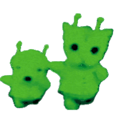

#  ¡Hola! Soy SOFI!

### Me encanta programar mientras mi gato duerme en el teclado 

  

  

  

## 🚀 Mi Mundo

*  **Pasión:** Programación, videojuegos y, por supuesto, los gatos.
*  **Enfoque actual:** Aprendiendo nuevas tecnologías para dominar el mundo.
*  **Dato curioso:** Mi código corre gracias a una mezcla de café y ronroneos.
*  **Próximo Nivel:** Diseñando mundos épicos en el desarrollo de videojuegos.

---

  

### 🛠️ CRAFTEANDO MI INVENTARIO:

<table align="center">
  <tr>
    <td align="center">
       
      
    </td>
    <td align="center">
       
      
    </td>
    <td align="center">
       
      
    </td>
    <td align="center">
       
      
    </td>
    <td align="center">
       
      
    </td>
  </tr>
</table>

---

### 📱 CONECTEMOS CONMIGO:

  

  

  

