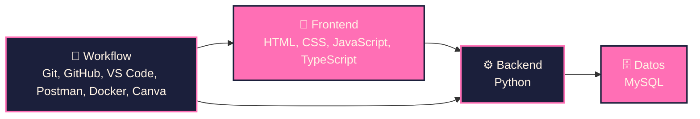

<div align="center">
  
</div>
<div align="center">
  
</div>

<div align="center">

[](https://github.com/ArrivillagaDAS)
[](https://github.com/ArrivillagaDAS)
[](https://www.linkedin.com/in/angela-arrivillaga-4290aa425)
[](https://arrivillagadas.github.io/Portafolio_HTML/)

</div>

<br />

## 🟣 **Sobre mi**
 
**Desarrolladora Junior en formacion** — Guatemala, Guatemala | Disponible para practicas
 
Estudiante de Desarrollo de Software, apasionada por crear interfaces limpias y funcionales. Me formo en HTML, CSS, JavaScript y bases de datos, con especial interes en el desarrollo de videojuegos y experiencias interactivas. Disfruto resolver problemas con codigo ordenado y documentado.
 
> Buscando mi primera oportunidad como desarrolladora para seguir aprendiendo, aportar con dedicacion y crecer junto a un equipo.
 
<br />

## 🔵 **Que hago?**
 
<table>
  <tr>
    <td width="50%">
      <h3>💻 Frontend</h3>
      <p>Convierto ideas en experiencias interactivas y dinamicas, pensadas para atrapar a quien las usa.</p>
    </td>
    <td width="50%">
      <h3>🚀 Proyectos y soluciones</h3>
      <p>Doy vida a proyectos que combinan creatividad y funcionalidad, del concepto al resultado final.</p>
    </td>
  </tr>
  <tr>
    <td width="50%">
      <h3>🛠️ Trabajo tecnico</h3>
      <p>Construyo con codigo limpio y logica solida, cuidando cada detalle detras de la pantalla.</p>
    </td>
    <td width="50%">
      <h3>📚 Aprendizaje continuo</h3>
      <p>Aprendo sin parar, transformando cada reto en una nueva habilidad para seguir creciendo.</p>
    </td>
  </tr>
</table>
<br />

## 🔵 **Arsenal tecnico**
 
<div align="center">
  
</div>

<br />

```yaml
frontend:  HTML, CSS, JavaScript, TypeScript
backend:   Python
databases: MySQL
tools:     Git, GitHub, VS Code, Postman, Docker, Canva
```
 
<br />

## 🔵 **Arquitectura de mis soluciones**
 

```mermaid
flowchart LR
  A["🎨 Frontend<br/>HTML, CSS, JavaScript, TypeScript"] --> B["⚙️ Backend<br/>Python"]
  B --> C["🗄️ Datos<br/>MySQL"]
  D["🧰 Workflow<br/>Git, GitHub, VS Code, Postman, Docker, Canva"] --> A
  D --> B

  classDef rosa fill:#FF6FB5,stroke:#1B1F3B,stroke-width:2px,color:#FFF3E4;
  classDef navy fill:#1B1F3B,stroke:#FF6FB5,stroke-width:2px,color:#FFF3E4;
  class A,C rosa;
  class B,D navy;
```
 
<br />

## ✨ **Estadisticas de GitHub**
 
<div align="center">
  
</div>

<div align="center">
  
  
</div>

<div align="center">
  
</div>

<div align="center">
  
</div>

<br />

## 📈 **Como trabajo**
 
```txt
Analisis -> estructura -> desarrollo -> validacion -> documentacion -> mejora
```
 
<table>
  <tr>
    <td>🎯 Orden tecnico</td>
    <td>Sigo un proceso claro en cada proyecto: pienso, ordeno y construyo paso a paso, sin dejar cabos sueltos.</td>
  </tr>
</table>
<br />

## 🟡 **Aprendiendo ahora**
 
-  MySQL
-  N8N
-  Postman
<br />

## 💌 **Contacto**
 
<div align="center">
  <a href="https://www.linkedin.com/in/angela-arrivillaga-4290aa425">
    
  </a>
  <a href="mailto:sfaaldana101@gmail.com">
    
  </a>
  <a href="https://github.com/ArrivillagaDAS">
    
  </a>
</div>

<br />

<div align="center">
  <strong>Disponible para practicas | Guatemala, Guatemala | Agosto 2026</strong>
</div>

<br />

<div align="center">
  
</div>
